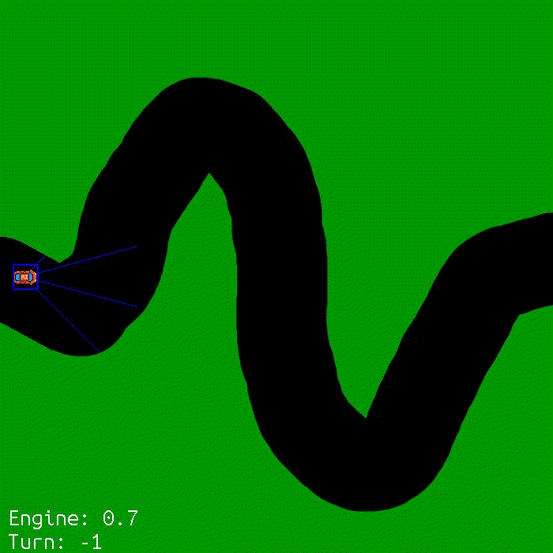

# Self Steering Car
AI learns to steer along a track using Reinforcement Learning. This is the same Reinforcment Learning algorithm that I used in my Snake AI project.

The simulation works by generating a random track, then making the AI agent drive the car sprite by repeatedly feeding in the distances from walls through raycasts into the neural net and using the output of the neural net to steer the car. Rather than using the output directly, the output is treated as classes: 0 means turn left and 1 means turn right. By treating the output as classes, softmax can be applied to get a probability distribution on these classes which can then be used to dictate the AI agent's random movement. It is important for the AI to move somewhat randomly as it needs to explore all possibilities to see the reward of each outcome, so that it can learn how to maximize this reward. The AI is rewarded based on its X-coordinate or how right it is to the screen as the better it is as steering, the farther right it will get, hence it is rewarded based on this factor. The AI is also given a bonus once it reached the end and also an extra bonus based on how weaved the track was (as highly weaved tracks are more difficult for steering). Crashing gives a negative reward and it is more negative if it crashes towards the end.    

This is not the same as a self-driving car as the AI has no control over its speed and its speed can be adjusted programmatically. This is done to simplify the problem as the AI only needs to worry about steering. 

# Results
I drew a track in Paint and tested the AI at different stages of training. 

This is the AI driving with no experience (0 simulations):

  

This is the AI driving after 100 training simulations. The AI thinks crashing into the wall is its objective:
 

  

This is the AI driving after 500 training simulations. Still hasn't figured it out:
 

  

This is the AI driving after 1000 training simulations:
 

  

This is the AI driving after 3000 training simulations. The AI has now learned how to steer along a track:
 

  

This is the AI driving after 6000 training simulations. The AI has now learned how to steer along the track but has also started to stick more towards the center of the track:
 

  

# Usage
In car.py, there are 3 main classes: Road, Car and Car Simulation. Road loads the 'resources/road.png' as a sprite and fully covers the screen with the sprite. Car controls the car's physics and also the rotation/movement of the car sprite. The Car Simulation class handles the training of the AI, the generation of the track, the creation and sprite updates, the collision checks and the raycasting. 

The parameters of the agent and whether or not the agent should load the most recent model can be edited in the init method if the Car Simulation Class. In the __main__ block, the debug vision can be toggled as well as whether or not the simulation should generate a new track each time or should use one pre-drawn track each time. The parameters of the track generation can edited in the run method of the Car Simulation Class. 

In the __main__ block, keyboard_play will toggle keyboard input. If it is true, you control the car and try the simulation for yourself! (Controls are A to turn left and D to turn right).

# Dependencies
- keras
- pygame
- termcolor (color terminal outputs)
